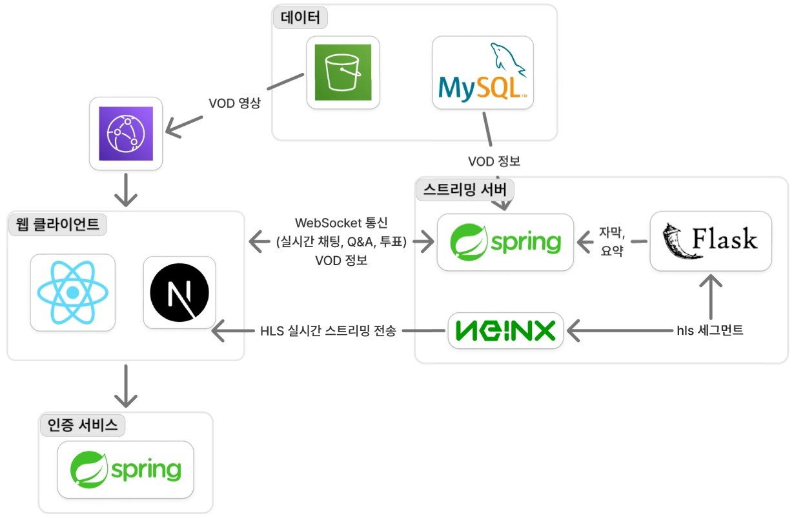
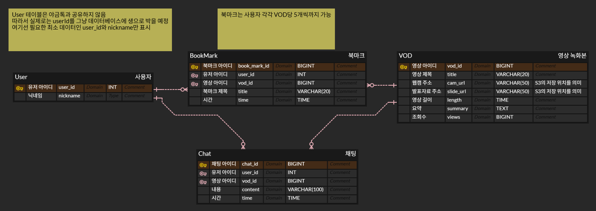

# 🎥 Kumoh Talk Streaming Backend

> 발표 화면과 웹캠을 각각 RTMP로 받아 HLS로 변환하고, 실시간 상호작용부터 방송 종료 후 VOD까지 하나의 생명주기로 관리하는 세미나 스트리밍 서버입니다.

<p align="center">
  <strong>라이브 송출 · 실시간 참여 · AI 자막 · VOD 복습을 하나의 흐름으로</strong>
</p>

<p align="center">
  <code>RTMP</code> → <code>FFmpeg</code> → <code>HLS</code>
  &nbsp;·&nbsp; <code>STOMP WebSocket</code>
  &nbsp;·&nbsp; <code>Redis</code>
  &nbsp;·&nbsp; <code>S3 / CloudFront</code>
</p>

## 📑 목차

- [📌 프로젝트 개요](#-프로젝트-개요)
- [✨ 주요 기능](#-주요-기능)
- [🏗️ 시스템 아키텍처](#️-시스템-아키텍처)
- [🔧 핵심 기술과 문제 해결](#-핵심-기술과-문제-해결)
- [🛠️ 기술 스택](#️-기술-스택)
- [🤝 기여](#-기여)
- [🗂️ 데이터 모델](#️-데이터-모델)
- [📡 API 요약](#-api-요약)
- [📂 프로젝트 구조](#-프로젝트-구조)
- [🚀 실행 방법](#-실행-방법)

## 📌 프로젝트 개요

| 구분 | 내용 |
| --- | --- |
| **프로젝트명** | Kumoh Talk |
| **서비스 유형** | AI 기반 온라인 세미나 스트리밍 플랫폼 |
| **저장소 역할** | 라이브 스트리밍·실시간 상호작용·VOD 백엔드 |
| **미디어 흐름** | RTMP ingest → FFmpeg → HLS live/VOD delivery |

> **“라이브 송출, 실시간 참여, AI 보조, 종료 후 복습을 하나의 미디어 생명주기로 연결한다.”**

화면과 웹캠을 하나의 방송으로 관리하고, HLS 라이브 전달과 S3 영구 저장을 분리했습니다. 시청자는 STOMP 기반 채팅·Q&A·투표에 참여하며, 방송이 끝나면 동일한 세그먼트를 VOD로 다시 볼 수 있습니다. 발표자 1명과 다수 시청자 구조에 맞춰 초저지연보다 호환성과 안정적인 전달에 강점이 있는 **RTMP ingest + HLS delivery**를 선택했습니다.

## ✨ 주요 기능

| 영역 | 주요 기능 |
| --- | --- |
| **라이브 스트리밍** | 화면·웹캠 분리 송출, 1초 단위 HLS 변환, 스트림 키·방송 정보·시청자 수 관리 |
| **실시간 상호작용** | STOMP 채팅, 익명 Q&A·좋아요, 단일·복수 투표, JWT 기반 메시지 인가 |
| **AI 자막·요약** | 데스크톱 HLS의 오디오 분리, Audio AI API 연동, 자막·요약 실시간 전파 |
| **VOD·북마크** | 전체 플레이리스트 재구성, CloudFront Signed URL, 시점 북마크 관리 |

## 🏗️ 시스템 아키텍처

### 송출과 저장

<p align="center">
  
</p>

1. 송출 프로그램이 `{streamKey}_desktop`, `{streamKey}_webcam` 두 RTMP 스트림을 Nginx-RTMP로 전송합니다.
2. Nginx의 `on_publish` 콜백이 Spring 서버에 송출 시작을 알립니다.
3. Spring은 스트림 키를 검증하고 FFmpeg를 실행해 각 입력을 1초 단위 HLS로 변환합니다.
4. 파일 감시기가 새 TS 세그먼트를 감지해 S3에 업로드합니다.
5. `on_done` 콜백을 받으면 VOD 플레이리스트를 생성하고 메타데이터를 MySQL에 저장합니다.

### 시청과 실시간 상호작용

<p align="center">
  
</p>

- 라이브 영상은 Nginx HTTP 서버의 HLS 경로를 통해 웹 클라이언트에 전달됩니다.
- 채팅·Q&A·투표와 자막·요약은 STOMP WebSocket으로 전달됩니다.
- 데스크톱 HLS에서 분리한 오디오는 외부 Audio API가 처리하고, 결과는 Spring을 거쳐 구독자에게 전파됩니다.
- VOD는 MySQL에서 메타데이터를 조회한 뒤 CloudFront Signed URL로 접근 권한을 제한합니다.

### 데이터 저장 기준

데이터의 수명과 접근 패턴에 따라 저장소를 분리했습니다.

| 데이터 | 저장소 | 선택 이유 |
| --- | --- | --- |
| 라이브 방송 정보·Q&A·투표·접속 세션 | Redis | 방송 중 빈번하게 변경되고 종료 후 수명이 짧은 상태 |
| 채팅·VOD 메타데이터·북마크 | MySQL | 방송 이후에도 조회해야 하는 관계형 데이터 |
| TS 세그먼트·플레이리스트·썸네일 | Amazon S3 | 용량이 큰 정적 미디어의 내구성 있는 저장 |
| VOD 전송 | Amazon CloudFront | CDN 전송과 Signed URL을 통한 제한된 접근 |

## 🔧 핵심 기술과 문제 해결

### 1. 가설 검증으로 FFmpeg 중복 입력 충돌 해결

**문제**

RTMP 스트림을 HLS로 변환하면서 AI 서버에 전달할 오디오를 동시에 분리하자 FFmpeg 프로세스가 간헐적으로 멈췄습니다. 명확한 오류 로그 없이 중단되고 같은 조건에서도 정상 실행될 때가 있어, 한 번의 로그만으로 원인을 특정하기 어려웠습니다.

**가설과 분석**

먼저 Spring Boot의 `ProcessBuilder` 실행 방식이나 프로세스 관리가 원인이라고 가정했습니다. Spring Boot를 거치지 않고 Nginx-RTMP에서 FFmpeg를 직접 실행했지만 같은 현상이 재현되어 Spring 연동 문제를 원인에서 제외했습니다.

이후 입력과 출력 경로를 단계적으로 분리해 실험한 결과 다음 조건에서 충돌이 발생한다는 것을 확인했습니다.

- 영상 변환용 FFmpeg와 오디오 분리용 FFmpeg가 하나의 RTMP 입력을 동시에 소비
- 여러 프로세스가 같은 저장 경로와 파일에 접근

**해결**

- 오디오 FFmpeg가 원본 RTMP에 직접 접근하지 않도록 입력 경로를 변경했습니다.
- 영상 변환 과정에서 생성된 HLS를 오디오 FFmpeg의 입력으로 재사용했습니다.
- 방송별 HLS·오디오 저장 디렉터리를 동적으로 생성해 프로세스 간 파일 경로를 분리했습니다.

| 개선 전: 동일 RTMP 중복 접근 | 개선 후: HLS 기반 입력 분리 |
| --- | --- |
|  |  |

**결과**

- 동일 RTMP 입력에 대한 두 FFmpeg의 중복 접근 제거
- HLS 변환과 AI 오디오 전달 프로세스의 동시 실행 안정화
- 방송별 저장 경로 분리를 통한 파일 충돌 방지
- 오류 메시지가 부족한 상황에서 가설을 세우고 실험으로 원인을 제외하는 디버깅 과정 정립

### 2. CloudFront Custom Policy로 HLS 서명 발급 O(n) → O(1)

**문제**

방송 종료 후 생성한 VOD를 S3에 저장하고 허가된 사용자에게만 제공하기 위해 S3 Presigned URL을 검토했습니다. 그러나 HLS는 하나의 영상 파일이 아니라 `index.m3u8`과 다수의 TS 세그먼트로 구성됩니다.

세그먼트마다 Presigned URL을 발급하면 영상 길이에 비례해 백엔드의 서명 발급과 플레이리스트 URL 가공이 반복됩니다.

```text
VOD 한 편 = m3u8 1개 + TS 세그먼트 n개
S3 객체별 서명 발급 = O(n)
```

**해결**

- VOD 제공 경로를 S3 개별 객체 URL에서 CloudFront로 전환했습니다.
- 백엔드가 사용자의 VOD 접근 권한을 확인한 뒤 CloudFront Signed URL을 한 번 발급합니다.
- Custom Policy의 리소스 패턴에 VOD 디렉터리 전체를 지정해 m3u8과 하위 TS 세그먼트에 동일한 서명을 적용합니다.
- 클라이언트가 m3u8 URL의 서명 쿼리를 세그먼트 요청에도 전달하도록 구성했습니다.
- URL에 만료 시간을 적용해 무기한 공유와 재사용을 제한했습니다.

**결과**

- 재생 세션당 백엔드의 서명 발급 횟수를 O(n)에서 O(1)로 개선
- 플레이리스트의 세그먼트 URL을 개별 서명 URL로 변환하는 처리 제거
- 백엔드는 권한 확인과 서명 발급, CloudFront는 미디어 전송과 캐싱을 담당하도록 역할 분리
- 제한 시간 동안 VOD 경로 전체에 접근할 수 있는 일관된 인증 구조 확보

### 3. 동시에 도착하는 두 RTMP Publish 이벤트의 중복 방송 생성 방지

**문제**

발표 화면과 웹캠은 `{streamKey}_desktop`, `{streamKey}_webcam`이라는 별도의 RTMP 연결로 송출됩니다. 두 연결의 Nginx `on_publish` 콜백이 거의 동시에 도착하면 각각 새로운 방송을 생성해 하나의 세미나가 서로 다른 방송 ID로 나뉠 수 있습니다.

**해결**

- Redis `SET NX` 기반의 짧은 락으로 동일 업로드 키의 방송 생성 구간을 직렬화했습니다.
- 최초 요청만 방송 ID와 화면·웹캠 시청 키를 생성합니다.
- 뒤따른 요청은 이미 생성된 방송을 조회하고 송출 타입에 맞는 시청 키를 사용합니다.
- 송출자가 사용하는 업로드 키와 시청자에게 노출되는 시청 키를 분리했습니다.

```text
desktop publish ─┐
                 ├─ Redis lock(streamKey) ─ 단일 Streaming 생성
webcam publish ──┘                         ├─ slideWatchKey
                                           └─ camWatchKey
```

**결과**

- 동시에 시작되는 화면·웹캠 송출을 하나의 방송 ID로 통합
- 송출 타입별 HLS 경로를 유지하면서 공통 방송 생명주기로 관리
- 외부에 노출된 시청 키만으로 임의 송출할 수 없도록 업로드 키와 시청 키 분리

현재 구현은 짧은 락과 제한된 재조회로 동시 생성을 제어합니다. 다중 인스턴스로 확장할 때는 락 소유권 토큰과 원자적 해제를 보장하는 분산 락으로 강화할 수 있습니다.

## 🛠️ 기술 스택

| 구분 | 기술 |
| --- | --- |
| Language | Java 21 |
| Framework | Spring Boot 3.4.4, Spring Security, Spring Data JPA, Spring Data Redis |
| Realtime | WebSocket, STOMP, SockJS |
| Database | MySQL 8.0, Redis 7.2 |
| Streaming | Nginx, nginx-rtmp-module, FFmpeg, HLS |
| Storage / CDN | Amazon S3, Amazon CloudFront |
| Build / Test | Gradle 8.13, JUnit 5, Spring Boot Test |
| Infrastructure | Docker, Docker Compose |

### 기술 선택 이유

| 선택 | 이유와 트레이드오프 |
| --- | --- |
| **STOMP over WebSocket** | Raw WebSocket 위에 destination 기반 라우팅과 pub/sub 규칙을 두어 채팅·Q&A·투표 채널을 일관되게 관리합니다. |
| **Redis + MySQL 분리** | 수명이 짧고 변경이 잦은 라이브 상태는 Redis에, 방송 이후에도 남아야 하는 데이터는 MySQL에 저장합니다. |
| **NIO WatchService** | 주기적으로 디렉터리를 전체 탐색하지 않고 파일 생성 이벤트를 감지해 새 HLS 세그먼트를 업로드합니다. |

## 🤝 기여

### 정보경 · Streaming Backend

<p align="left">
  <a href="https://github.com/jungbk0808">
    
  </a>
</p>

| 담당 영역 | 기여 내용 | 관련 코드 |
| --- | --- | --- |
| 스트리밍 생명주기 | 스트림 키 발급·검증, 화면·웹캠 동시 시작 제어, RTMP 시작·종료 처리 | [StreamingService](src/main/java/com/kumoh_talk/streaming/domain/stream/service/StreamingService.java) |
| 미디어 파이프라인 | FFmpeg HLS 변환·오디오 분리·썸네일 생성, 세그먼트 파일 감시 | [FfmpegExecutor](src/main/java/com/kumoh_talk/streaming/global/util/FfmpegExecutor.java), [HlsWatcher](src/main/java/com/kumoh_talk/streaming/global/watchService/HlsWatcher.java) |
| VOD 전달 | TS 세그먼트 S3 업로드, VOD 플레이리스트 재구성, CloudFront Signed URL 발급 | [S3Service](src/main/java/com/kumoh_talk/streaming/global/file/service/S3Service.java) |
| 실시간 상호작용 | STOMP 채팅·Q&A·투표, Redis 상태 모델링, 접속 세션 정리 | [domain](src/main/java/com/kumoh_talk/streaming/domain) |
| 인증·예외 처리 | REST JWT 인증과 STOMP 메시지별 토큰·역할 검증, 세션 전용 오류 전달 | [WebSocketAuthValidator](src/main/java/com/kumoh_talk/streaming/global/socket/security/WebSocketAuthValidator.java) |
| 실행 환경 | Spring·Nginx-RTMP·MySQL·Redis·FFmpeg의 Docker Compose 구성 | [docker-compose.yml](docker-compose.yml) |

## 🗂️ 데이터 모델

영속 데이터는 VOD·북마크·채팅으로 한정하고, 방송 중에만 필요한 상태는 Redis에 분리했습니다.

<p align="center">
  
</p>

Redis에는 `Streaming`과 `Vote` 객체를 저장하고, Q&A·좋아요·투표 선택·접속 세션은 Hash와 Set으로 관리합니다. 외부 인증 서버의 사용자는 이 서비스에서 `userId`로만 참조해 사용자 데이터의 소유 경계를 분리했습니다.


## 📡 API 요약

모든 REST 응답은 공통 `ResponseBody` 형식이며, 인증 요청은 `Authorization: Bearer <JWT>` 헤더를 사용합니다.

<details>
<summary><strong>REST API 펼쳐 보기</strong></summary>

| 기능 | Method | Endpoint | 인증 |
| --- | --- | --- | --- |
| 스트림 키 발급 | POST | `/stream/streamKey` | USER, ADMIN |
| 스트림 키 조회 | GET | `/stream/streamKey` | USER, ADMIN |
| 스트리밍 제목 변경 | PATCH | `/stream/title` | USER, ADMIN |
| 스트리밍 목록 조회 | GET | `/stream/list` | 공개 |
| 스트리밍 상세 조회 | GET | `/stream/{streamId}` | 공개 |
| 투표 생성 | POST | `/vote/{streamId}` | USER, ADMIN |
| 투표 결과 조회 | GET | `/vote/{streamId}/{voteId}` | USER, ADMIN |
| 투표 종료 | DELETE | `/vote/{streamId}/{voteId}` | USER, ADMIN |
| VOD 목록 조회 | GET | `/vod` | USER |
| VOD 상세 조회 | GET | `/vod/{vodId}` | USER |
| 북마크 목록 조회 | GET | `/bookmark/{vodId}` | USER |
| 북마크 생성 | POST | `/bookmark/{vodId}` | USER |
| 북마크 삭제 | DELETE | `/bookmark/{vodId}/{bookmarkId}` | USER |
| 송출 시작 알림 | POST | `/stream/start` | Nginx-RTMP 연동 |
| 송출 종료 알림 | POST | `/stream/stop` | Nginx-RTMP 연동 |
| 자막 수신 | POST | `/stream/caption` | Audio API 연동 |
| 요약 수신 | POST | `/stream/summary` | Audio API 연동 |

</details>

<details>
<summary><strong>WebSocket destination 펼쳐 보기</strong></summary>

- 연결 endpoint: `/ws-stomp` (WebSocket, SockJS)
- 클라이언트 SEND prefix: `/app`
- 인증이 필요한 SEND: native header `Authorization: Bearer <JWT>`

| SEND 기능 | Destination | 인증 |
| --- | --- | --- |
| 투표 목록 요청 | `/app/streaming/{streamId}/vote-list` | 공개 |
| 투표 참여 | `/app/streaming/{streamId}/submit-vote/{voteId}` | USER |
| Q&A 목록 요청 | `/app/streaming/{streamId}/qna-list` | 공개 |
| Q&A 등록 | `/app/streaming/{streamId}/add-qna` | USER |
| Q&A 좋아요 | `/app/streaming/{streamId}/liked-qna/{qnaId}` | USER |
| Q&A 삭제 | `/app/streaming/{streamId}/delete-qna/{qnaId}` | USER |
| 채팅 전송 | `/app/streaming/{streamId}/add-chat` | USER |

| SUBSCRIBE 기능 | Destination |
| --- | --- |
| 투표 목록 | `/streaming/vote-list/{sessionId}` |
| 투표 생성·종료 | `/streaming/vote/{streamId}/add-vote`, `/streaming/vote/{streamId}/close` |
| Q&A 목록 | `/streaming/qna-list/{sessionId}` |
| Q&A 등록·좋아요·삭제 | `/streaming/qna/{streamId}/add`, `/liked`, `/delete` |
| 채팅 | `/streaming/chat/{streamId}/add` |
| 제목 변경 | `/streaming/title/{streamId}` |
| 자막·요약 | `/streaming/caption`, `/streaming/summary` |
| 세션 전용 오류 | `/user/{sessionId}/queue/errors` |

</details>

## 📂 프로젝트 구조

```text
src/main/java/com/kumoh_talk/streaming
├─ domain
│  ├─ bookmark       # VOD 북마크
│  ├─ chat           # 실시간 채팅
│  ├─ qna            # 실시간 Q&A
│  ├─ stream         # 라이브 스트리밍과 VOD
│  └─ vote           # 실시간 투표
└─ global
   ├─ auth           # JWT 인증과 역할
   ├─ config         # Security, Redis, WebSocket, 비동기 설정
   ├─ exception      # REST·WebSocket 공통 예외 처리
   ├─ file           # S3, CloudFront 연동
   ├─ socket         # STOMP 세션과 메시지 인증
   ├─ util           # FFmpeg, Audio API 연동
   └─ watchService   # HLS 파일 감시와 업로드
```

## 🚀 실행 방법

<details>
<summary><strong>환경 변수와 Docker 실행 방법 펼쳐 보기</strong></summary>

### 사전 요구 사항

- Docker 및 Docker Compose
- AWS S3 버킷과 접근 자격 증명
- CloudFront 배포, 공개 키 ID, 서명용 개인 키
- 인증 서버와 공유하는 JWT Secret Key
- `/start`, `/end` 요청을 처리하는 외부 Audio API

### 환경 변수

프로젝트 루트에 `.env` 파일을 생성합니다. CloudFront 개인 키와 `.env`는 Git에 커밋하지 않습니다.

```dotenv
MYSQL_ROOT_PASSWORD=<mysql-root-password>
MYSQL_DATABASE=<database-name>
MYSQL_USER=<database-user>
MYSQL_PASSWORD=<database-password>

REDIS_PASSWORD=<redis-password>

BUCKET_NAME=<s3-bucket-name>
BUCKET_REGION=<aws-region>
BUCKET_ACCESS_KEY=<aws-access-key>
BUCKET_SECRET_KEY=<aws-secret-key>

CLOUDFRONT_DOMAIN_NAME=<cloudfront-domain-with-scheme>
CLOUDFRONT_PUBLIC_KEY_ID=<cloudfront-public-key-id>
HOST_CLOUDFRONT_PRIVATE_KEY_PATH=<private-key-path-on-host>
CLOUDFRONT_PRIVATE_KEY_PATH=/run/secrets/cloudfront-private-key.pem
CLOUDFRONT_PRIVATE_KEY_FULL_PATH=/run/secrets/cloudfront-private-key.pem

JWT_SECRET_KEY=<jwt-secret-key>
HLS_URL=<hls-base-url>
AUDIO_API_URL=<audio-api-base-url>
HLS_PATH=<host-directory-for-hls-files>
```

`CLOUDFRONT_PRIVATE_KEY_PATH`와 `CLOUDFRONT_PRIVATE_KEY_FULL_PATH`는 컨테이너 내부의 같은 파일을 가리켜야 합니다. `HLS_URL`과 `AUDIO_API_URL`은 코드에서 하위 경로를 결합하므로 마지막 `/`를 포함한 형태로 설정합니다.

### 실행

Spring 런타임 베이스 이미지는 FFmpeg와 curl을 포함합니다. 최초 한 번 빌드합니다.

```bash
docker build -f dockerfile/Dockerfile.spring-base -t kumohtalk-streaming-openjdk .
docker compose up --build -d
```

| 서비스 | 호스트 포트 | 용도 |
| --- | ---: | --- |
| Spring Boot | 8081 | REST API, WebSocket |
| Nginx RTMP | 1935 | RTMP 송출 |
| Nginx HTTP | 9091 | HLS, RTMP 상태 페이지 |
| MySQL | 3308 | 영속 데이터 |
| Redis | 6380 | 라이브 상태 |

```bash
curl http://localhost:8081/actuator/health
docker compose ps
docker compose down
```

> `docker compose down -v`는 MySQL과 Redis 볼륨까지 삭제합니다.

</details>
