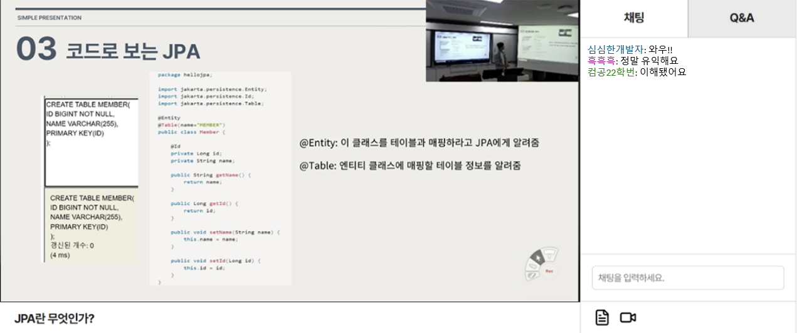
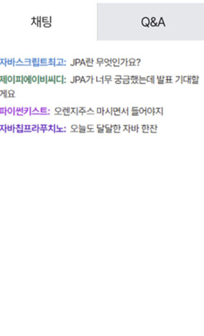
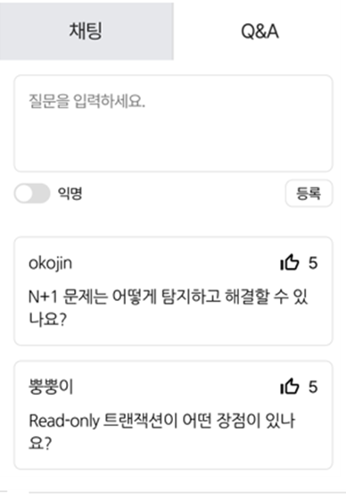
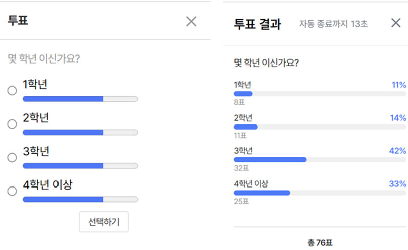
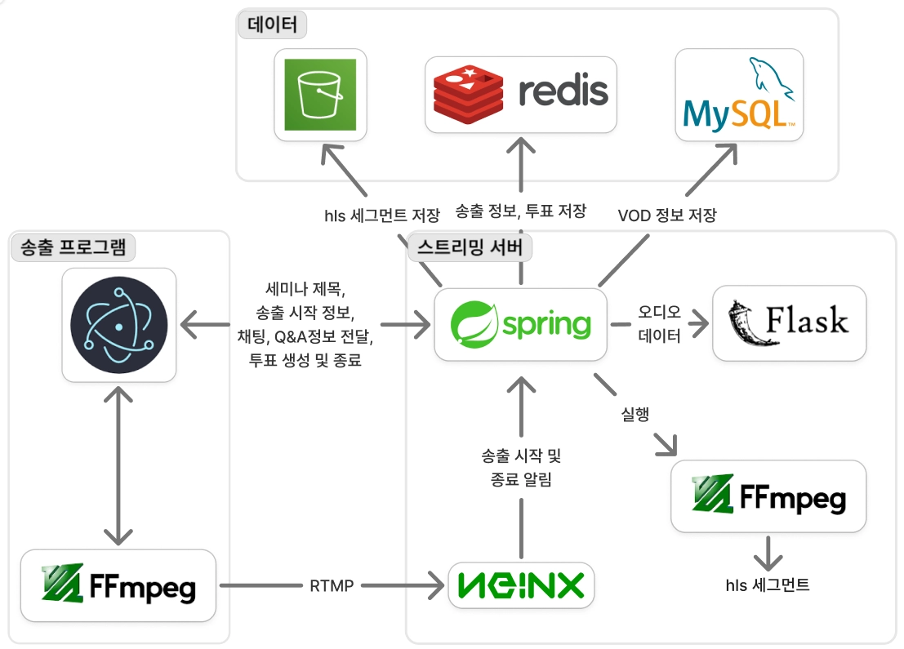

# 🎥 Kumoh Talk Streaming Backend

> 발표 화면과 웹캠을 각각 RTMP로 받아 HLS로 변환하고, 실시간 상호작용부터 방송 종료 후 VOD까지 하나의 생명주기로 관리하는 세미나 스트리밍 서버입니다.

<p align="center">
  <strong>라이브 송출 · 실시간 참여 · AI 자막 · VOD 복습을 하나의 흐름으로</strong>
</p>

<p align="center">
  <code>RTMP</code> → <code>FFmpeg</code> → <code>HLS</code>
  &nbsp;·&nbsp; <code>STOMP WebSocket</code>
  &nbsp;·&nbsp; <code>Redis</code>
  &nbsp;·&nbsp; <code>S3 / CloudFront</code>
</p>

## 📑 목차

- [🎥 Kumoh Talk Streaming Backend](#-kumoh-talk-streaming-backend)
  - [📑 목차](#-목차)
  - [📌 프로젝트 소개](#-프로젝트-소개)
  - [✨ 주요 기능](#-주요-기능)
  - [📚 세부 문서](#-세부-문서)
  - [🖼️ 작동 화면](#️-작동-화면)
    - [라이브 세미나 스트리밍](#라이브-세미나-스트리밍)
    - [실시간 채팅과 Q\&A](#실시간-채팅과-qa)
    - [투표](#투표)
  - [🏗️ 핵심 흐름](#️-핵심-흐름)
  - [🛠️ 기술 스택](#️-기술-스택)
  - [🚀 빠른 실행](#-빠른-실행)

## 📌 프로젝트 소개

| 구분 | 내용 |
| --- | --- |
| 프로젝트명 | Kumoh Talk |
| 서비스 유형 | AI 기반 온라인 세미나 스트리밍 플랫폼 |
| 저장소 역할 | 라이브 스트리밍·실시간 상호작용·VOD 백엔드 |
| 미디어 흐름 | RTMP ingest → FFmpeg → HLS live/VOD delivery |

화면과 웹캠을 하나의 방송으로 관리하고, HLS 라이브 전달과 S3 영구 저장을 분리했습니다. 시청자는 STOMP 기반 채팅·Q&A·투표에 참여하며, 방송이 끝나면 동일한 세그먼트를 VOD로 다시 볼 수 있습니다.

## ✨ 주요 기능

| 영역 | 주요 기능 |
| --- | --- |
| 라이브 스트리밍 | 화면·웹캠 분리 송출, 1초 단위 HLS 변환, 스트림 키·방송 정보·시청자 수 관리 |
| 실시간 상호작용 | STOMP 채팅, 익명 Q&A·좋아요, 단일·복수 투표, JWT 기반 메시지 인가 |
| AI 자막·요약 | 데스크톱 HLS의 오디오 분리, Audio AI API 연동, 자막·요약 실시간 전파 |
| VOD·북마크 | 전체 플레이리스트 재구성, CloudFront Signed URL, 시점 북마크 관리 |

## 📚 세부 문서

- [🏗️ 시스템 아키텍처](docs/architecture.md)
- [🔧 핵심 기술과 문제 해결](docs/technical-decisions.md)
- [📡 API 요약](docs/api.md)
- [🚀 실행 방법](docs/running.md)

## 🖼️ 작동 화면

### 라이브 세미나 스트리밍



### 실시간 채팅과 Q&A

| 실시간 채팅 | Q&A |
| --- | --- |
|  |  |

### 투표



## 🏗️ 핵심 흐름



1. 송출 프로그램이 발표 화면과 웹캠을 각각 RTMP 스트림으로 전송합니다.
2. Nginx-RTMP 콜백을 받은 Spring 서버가 스트림 키를 검증하고 FFmpeg 변환을 시작합니다.
3. 생성된 HLS 세그먼트는 라이브로 제공되고, 방송 종료 후 S3에 저장된 VOD로 재구성됩니다.
4. 채팅·Q&A·투표·자막·요약은 STOMP WebSocket을 통해 실시간으로 전달됩니다.

## 🛠️ 기술 스택

| 구분 | 기술 |
| --- | --- |
| Language | Java 21 |
| Framework | Spring Boot 3.4.4, Spring Security, Spring Data JPA, Spring Data Redis |
| Realtime | WebSocket, STOMP, SockJS |
| Database | MySQL 8.0, Redis 7.2 |
| Streaming | Nginx, nginx-rtmp-module, FFmpeg, HLS |
| Storage / CDN | Amazon S3, Amazon CloudFront |
| Build / Test | Gradle 8.13, JUnit 5, Spring Boot Test |
| Infrastructure | Docker, Docker Compose |

## 🚀 빠른 실행

```bash
docker build -f dockerfile/Dockerfile.spring-base -t kumohtalk-streaming-openjdk .
docker compose up --build -d
```

자세한 환경 변수와 실행 절차는 [실행 방법](docs/running.md)을 참고합니다.
