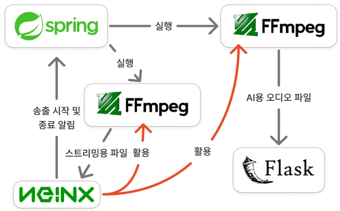
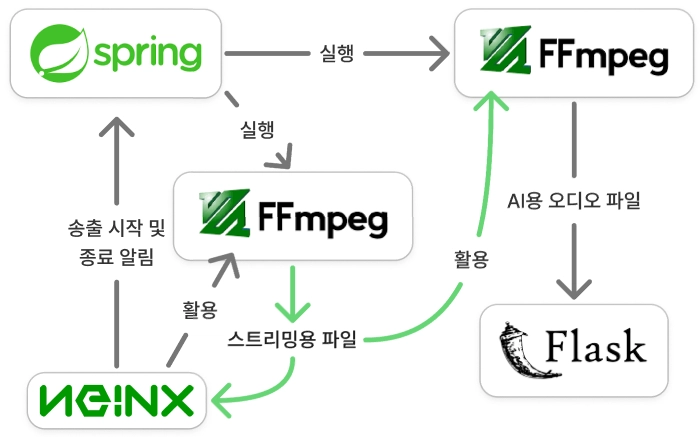

# 🔧 핵심 기술과 문제 해결

## 1. 가설 검증으로 FFmpeg 중복 입력 충돌 해결

### 문제

RTMP 스트림을 HLS로 변환하면서 AI 서버에 전달할 오디오를 동시에 분리하자 FFmpeg 프로세스가 간헐적으로 멈췄습니다. 명확한 오류 로그 없이 중단되고 같은 조건에서도 정상 실행될 때가 있어, 한 번의 로그만으로 원인을 특정하기 어려웠습니다.

### 가설과 분석

먼저 Spring Boot의 `ProcessBuilder` 실행 방식이나 프로세스 관리가 원인이라고 가정했습니다. Spring Boot를 거치지 않고 Nginx-RTMP에서 FFmpeg를 직접 실행했지만 같은 현상이 재현되어 Spring 연동 문제를 원인에서 제외했습니다.

이후 입력과 출력 경로를 단계적으로 분리해 실험한 결과 다음 조건에서 충돌이 발생한다는 것을 확인했습니다.

- 영상 변환용 FFmpeg와 오디오 분리용 FFmpeg가 하나의 RTMP 입력을 동시에 소비
- 여러 프로세스가 같은 저장 경로와 파일에 접근

### 해결

- 오디오 FFmpeg가 원본 RTMP에 직접 접근하지 않도록 입력 경로를 변경했습니다.
- 영상 변환 과정에서 생성된 HLS를 오디오 FFmpeg의 입력으로 재사용했습니다.
- 방송별 HLS·오디오 저장 디렉터리를 동적으로 생성해 프로세스 간 파일 경로를 분리했습니다.

| 개선 전: 동일 RTMP 중복 접근 | 개선 후: HLS 기반 입력 분리 |
| --- | --- |
|  |  |

### 결과

- 동일 RTMP 입력에 대한 두 FFmpeg의 중복 접근 제거
- HLS 변환과 AI 오디오 전달 프로세스의 동시 실행 안정화
- 방송별 저장 경로 분리를 통한 파일 충돌 방지
- 오류 메시지가 부족한 상황에서 가설을 세우고 실험으로 원인을 제외하는 디버깅 과정 정립

## 2. CloudFront Custom Policy로 HLS 서명 발급 O(n) → O(1)

### 문제

방송 종료 후 생성한 VOD를 S3에 저장하고 허가된 사용자에게만 제공하기 위해 S3 Presigned URL을 검토했습니다. 그러나 HLS는 하나의 영상 파일이 아니라 `index.m3u8`과 다수의 TS 세그먼트로 구성됩니다.

세그먼트마다 Presigned URL을 발급하면 영상 길이에 비례해 백엔드의 서명 발급과 플레이리스트 URL 가공이 반복됩니다.

```text
VOD 한 편 = m3u8 1개 + TS 세그먼트 n개
S3 객체별 서명 발급 = O(n)
```

### 해결

- VOD 제공 경로를 S3 개별 객체 URL에서 CloudFront로 전환했습니다.
- 백엔드가 사용자의 VOD 접근 권한을 확인한 뒤 CloudFront Signed URL을 한 번 발급합니다.
- Custom Policy의 리소스 패턴에 VOD 디렉터리 전체를 지정해 m3u8과 하위 TS 세그먼트에 동일한 서명을 적용합니다.
- 클라이언트가 m3u8 URL의 서명 쿼리를 세그먼트 요청에도 전달하도록 구성했습니다.
- URL에 만료 시간을 적용해 무기한 공유와 재사용을 제한했습니다.

### 결과

- 재생 세션당 백엔드의 서명 발급 횟수를 O(n)에서 O(1)로 개선
- 플레이리스트의 세그먼트 URL을 개별 서명 URL로 변환하는 처리 제거
- 백엔드는 권한 확인과 서명 발급, CloudFront는 미디어 전송과 캐싱을 담당하도록 역할 분리
- 제한 시간 동안 VOD 경로 전체에 접근할 수 있는 일관된 인증 구조 확보

## 3. 동시에 도착하는 두 RTMP Publish 이벤트의 중복 방송 생성 방지

### 문제

발표 화면과 웹캠은 `{streamKey}_desktop`, `{streamKey}_webcam`이라는 별도의 RTMP 연결로 송출됩니다. 두 연결의 Nginx `on_publish` 콜백이 거의 동시에 도착하면 각각 새로운 방송을 생성해 하나의 세미나가 서로 다른 방송 ID로 나뉠 수 있습니다.

### 해결

- Redis `SET NX` 기반의 짧은 락으로 동일 업로드 키의 방송 생성 구간을 직렬화했습니다.
- 최초 요청만 방송 ID와 화면·웹캠 시청 키를 생성합니다.
- 뒤따른 요청은 이미 생성된 방송을 조회하고 송출 타입에 맞는 시청 키를 사용합니다.
- 송출자가 사용하는 업로드 키와 시청자에게 노출되는 시청 키를 분리했습니다.

```text
desktop publish ─┐
                 ├─ Redis lock(streamKey) ─ 단일 Streaming 생성
webcam publish ──┘                         ├─ slideWatchKey
                                           └─ camWatchKey
```

### 결과

- 동시에 시작되는 화면·웹캠 송출을 하나의 방송 ID로 통합
- 송출 타입별 HLS 경로를 유지하면서 공통 방송 생명주기로 관리
- 외부에 노출된 시청 키만으로 임의 송출할 수 없도록 업로드 키와 시청 키 분리

현재 구현은 짧은 락과 제한된 재조회로 동시 생성을 제어합니다. 다중 인스턴스로 확장할 때는 락 소유권 토큰과 원자적 해제를 보장하는 분산 락으로 강화할 수 있습니다.

## 🛠️ 기술 선택 이유

| 선택 | 이유와 트레이드오프 |
| --- | --- |
| STOMP over WebSocket | Raw WebSocket 위에 destination 기반 라우팅과 pub/sub 규칙을 두어 채팅·Q&A·투표 채널을 일관되게 관리합니다. |
| Redis + MySQL 분리 | 수명이 짧고 변경이 잦은 라이브 상태는 Redis에, 방송 이후에도 남아야 하는 데이터는 MySQL에 저장합니다. |
| NIO WatchService | 주기적으로 디렉터리를 전체 탐색하지 않고 파일 생성 이벤트를 감지해 새 HLS 세그먼트를 업로드합니다. |
